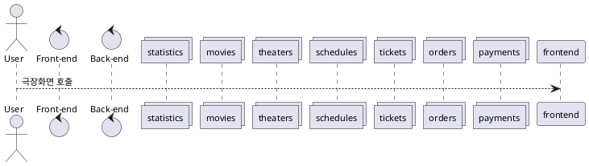
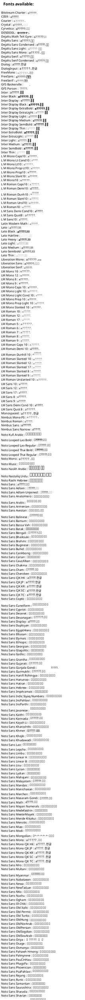

# Buying Tickets

actor : user
goal : 사용자가 영화 티켓을 구매한다.
preconditions : 사용자는 회원 가입 및 로그인 상태다.
main flow:

1. 사용자가 현재 상영중인 영화를 선택한다.
    - 영화 목록은 주간 순위, 월간 순위, 개봉일자로 정렬된다.
    - 영화를 선택하면 시놉시스, 사용자 후기 등 상세 정보를 볼 수 있다.
    - 검색을 통해서 과거에 상영했던 영화를 볼 수 있다.
2. 극장을 선택한다.
    - 선택한 영화를 상영 중인 극장만 보여준다
    - 사용자의 현재 위치에서 가까운 극장을 추천한다.
    - 반경 1.5km의 모든 극장. 없으면 가장 가까운 극장 5개
    - 지역을 선택하면 해당하는 극장 전체를 보여준다.
    - 지역은 여러단계로 이루어진다. 극장 목록을 보여주는 것은 마지막 단계다.
3. 상영 시간을 선택한다.
    - 매진되어 좌석이 없는 시간은 흐리게 표현한다.
4. 좌석을 선택한다.
    - 좌석은 등급과 종류가 있다.(로얄석, 커플석)
    - 좌석을 선택하면 10분 동안 선점 상태가 된다. 결제를 하기 전에 다른 사용자가 티켓을 구매하는 것을 막는다.
5. 결제한다.
    - 카드결제는 PaymentGateway 서비스를 사용한다.
6. 완료
    - 결제까지 성공하면 구매한 티켓 정보를 보여준다.

