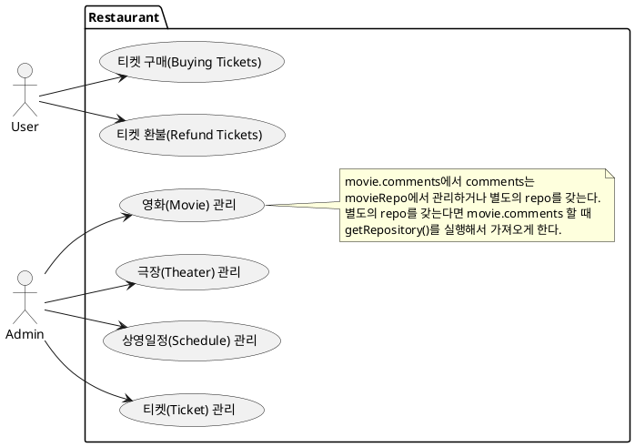

# Use Cases

https://plantuml.com/ko/use-case-diagram

1. 유스케이스로 도메인 전문가가 읽기 쉽게 정의
1. 어떤 데이터를 읽어야 하는지 정리한다. 엔티티를 알 수 있다.
1. 읽어야 하는 데이터가 정의되면, 그 데이터를 어떻게 생성할 것인지를 고민하면 된다.

```plantuml
@startuml
left to right direction
skinparam shadowing false

actor User as user
actor Admin as admin

package Restaurant {
  usecase "티켓 구매(Buying Tickets)" as buy
  usecase "티켓 환불(Refund Tickets)" as refund
  usecase "영화(Movie) 관리" as movie
note right
movie.comments에서 comments는
movieRepo에서 관리하거나 별도의 repo를 갖는다.
별도의 repo를 갖는다면 movie.comments 할 때
getRepository()를 실행해서 가져오게 한다.
end note
  usecase "극장(Theater) 관리" as theater
  usecase "상영일정(Schedule) 관리" as schedule
  usecase "티켓(Ticket) 관리" as ticket
}

user -->  buy
user -->  refund
admin -->  movie
admin -->  theater
admin -->  schedule
admin -->  ticket
@enduml
```
